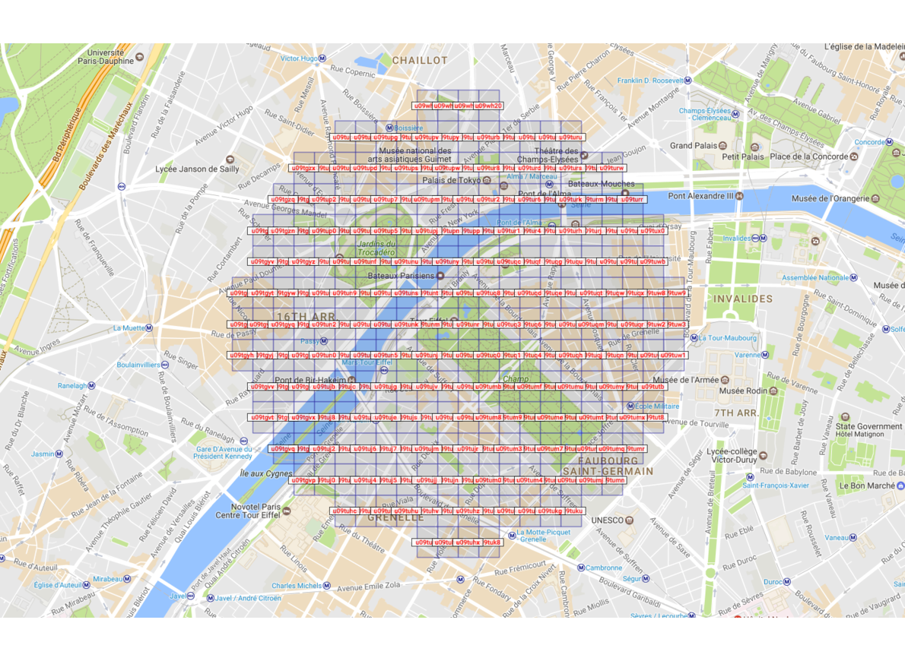
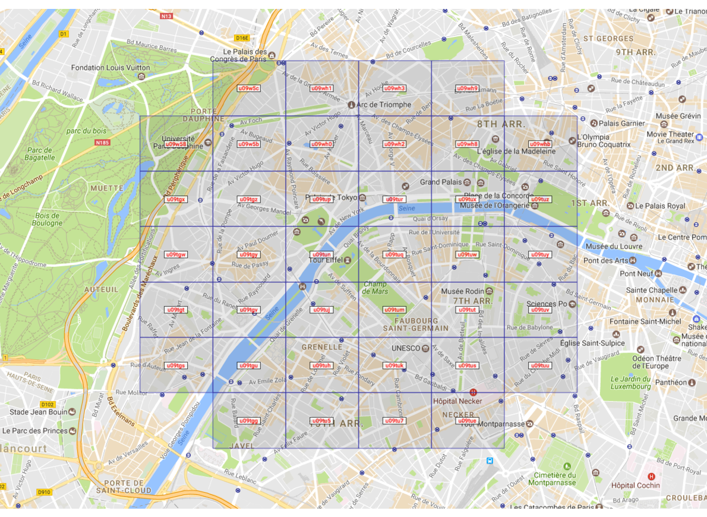

# vicinityhash

Given latitude, longitude and radius, this library converts a circular [geofence](https://en.wikipedia.org/wiki/Geo-fence) into a set of [geohashes](https://en.wikipedia.org/wiki/Geohash).

This code was developed based on [Ashwin Nair's algorithm](https://github.com/ashwin711/proximityhash).

## Installation

Via npm:

```bash
npm install --save vicinityhash
```

Via yarn:

```bash
yarn add vicinityhash
```

## Usage

With JavaScript:

```javascript
const vicinityhash = require('vicinityhash')

const geofence = {
  latitude: 51.51,
  longitude: -0.07,
  radius: 10000 // in meters
}

const geohashes = vicinityhash.convert(geofence)
```

With TypeScript:

```typescript
import * as vicinityhash from 'vicinityhash'

const geofence = {
  latitude: 51.51,
  longitude: -0.07,
  radius: 10000 // in meters
}

const geohashes: string[] = vicinityhash.convert(geofence)
```

Visual representation of the geohashes created based on the geofence:



### Optional Configuration

#### Precision

```javascript
const geofence = {
  latitude: 51.51,
  longitude: -0.07,
  radius: 20000
}

const config = {
  precision: 8 // 7 by default, accepts 1 to 12
}

const geohashes = vicinityhash.convert(geofence, config)
```

#### Compression

```javascript
const geofence = {
  latitude: 51.51,
  longitude: -0.07,
  radius: 20000
}

const config = {
  compress: true // false by default
}

const geohashes = vicinityhash.convert(geofence, config)
```

Visual representation of the geohashes created based on the geofence:


#### Compression Levels

```javascript
const geofence = {
  latitude: 51.51,
  longitude: -0.07,
  radius: 20000
}

const config = {
  compress: true,
  compressMin: 3, // 1 by default, accepts 1 to 12
  compressMax: 6 // 12 by default, accepts 1 to 12de
}

const geohashes = vicinityhash.convert(geofence, config)
```

Visual representation of the geohashes created based on the geofence:



## Development

### Prerequisites

- [Node.js >= 18](https://nodejs.org/en/download/releases)

### Test

Run this command to start unit tests:

```bash
npm test
```
